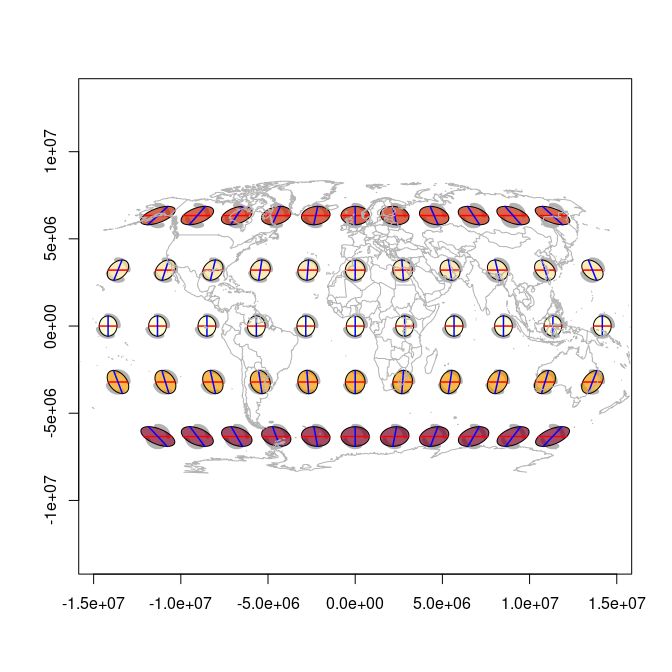
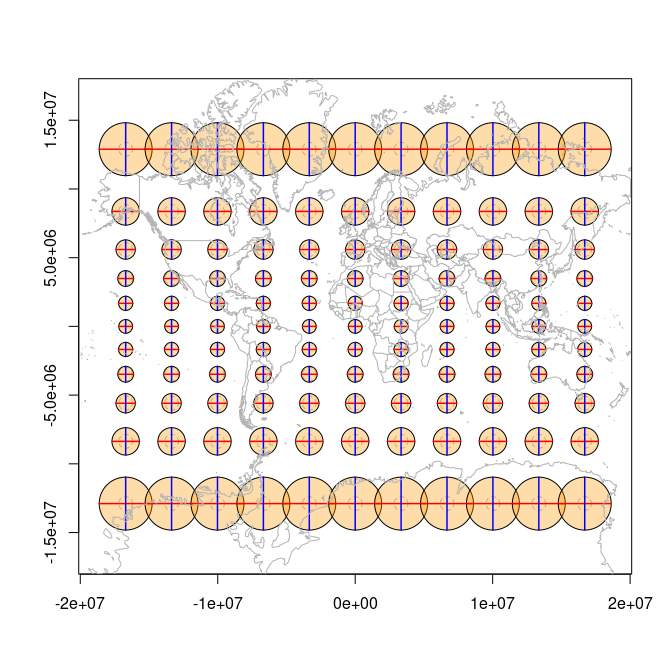
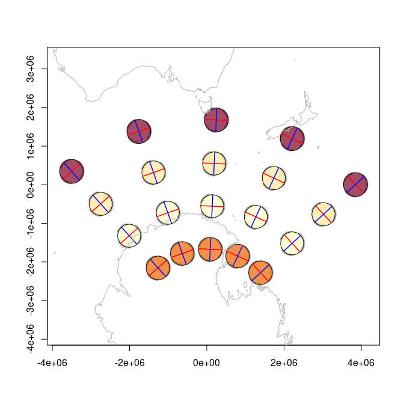
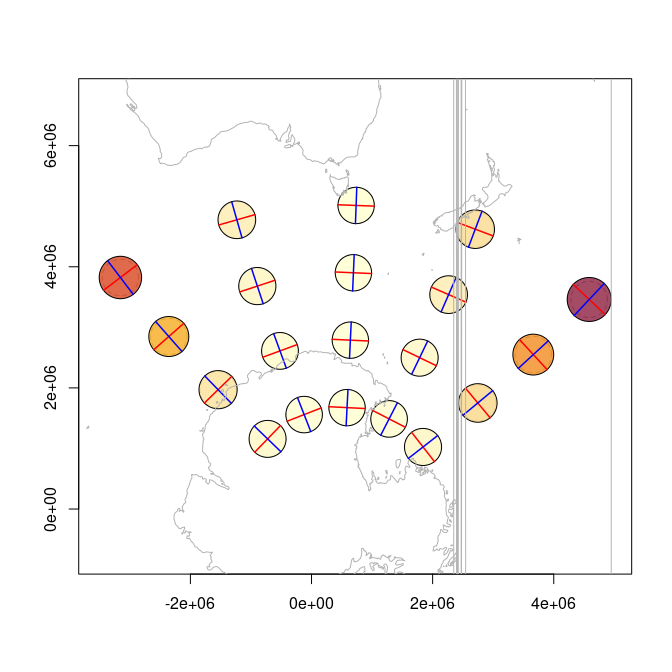
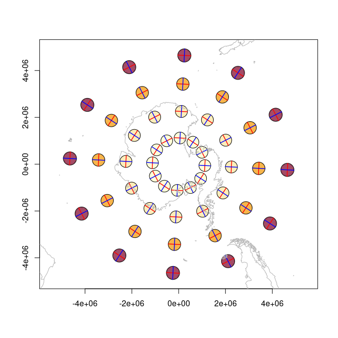
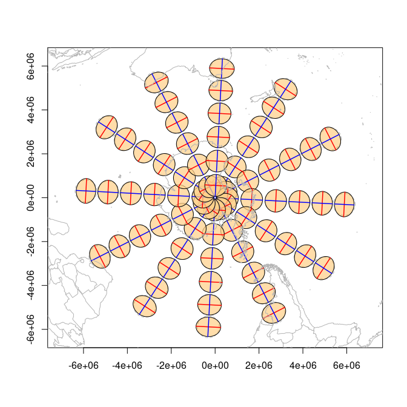
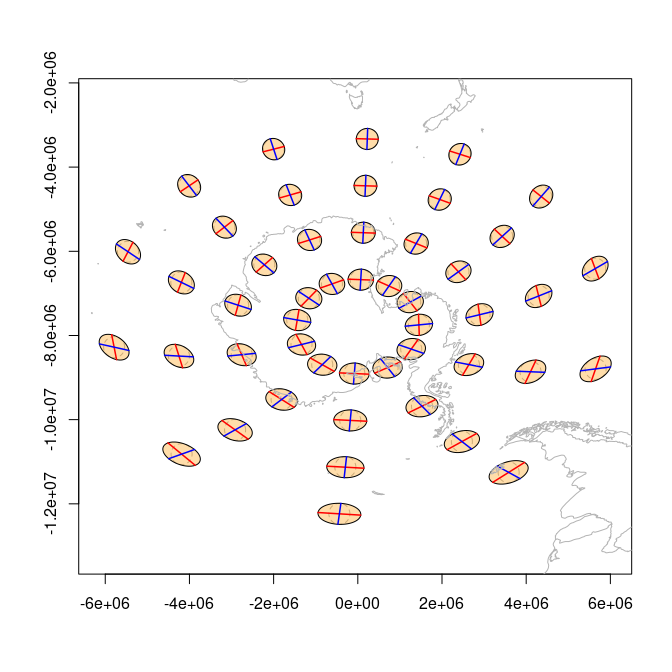
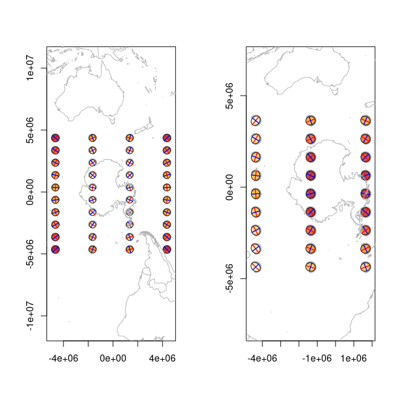

<!-- README.md is generated from README.Rmd. Please edit that file -->

<!-- badges: start -->

[](https://github.com/hypertidy/tissot/actions/workflows/R-CMD-check.yaml)
<!-- badges: end -->

# tissot

The [Tissot
Indicatrix](https://en.wikipedia.org/wiki/Tissot%27s_indicatrix)
characterizes local distortion in map projections. This package computes
and plots indicatrixes using a vectorized finite-difference Jacobian
with [gdalraster](https://firelab.github.io/gdalraster/) as the
projection engine.

Derived (with permission) from Bill Huber’s [GIS StackExchange
answer](https://gis.stackexchange.com/a/5075/482).

## Installation

``` r
# install.packages("pak")
pak::pak("hypertidy/tissot@refactor-2026")
```

## Quick start

`tissot()` returns a tibble of distortion properties. The second
argument is the projection `target`; `source` defaults to EPSG:4326:

``` r
library(tissot)
tissot(c(147, -42), "+proj=utm +zone=55 +south")
#> Tissot indicatrix: 1 point, +proj=utm +zone=55 +south
#> # A tibble: 1 × 14
#>       x     y dx_dlam    dy_dlam dx_dphi dy_dphi scale_h scale_k scale_omega
#>   <dbl> <dbl>   <dbl>      <dbl>   <dbl>   <dbl>   <dbl>   <dbl>       <dbl>
#> 1   147   -42 0.99960 -5.8386e-7       0 0.99960 0.99960 0.99960 0.000033471
#> # ℹ 5 more variables: scale_a <dbl>, scale_b <dbl>, scale_area <dbl>,
#> #   angle_deformation <dbl>, convergence <dbl>
```

Columns include: `scale_h` (meridional), `scale_k` (parallel), `scale_a`
/ `scale_b` (max/min singular values), `scale_area`,
`angle_deformation`, and `convergence`.

## Plotting indicatrixes

`indicatrix()` builds plottable ellipses. The dashed circle is the
undistorted reference; the filled ellipse shows the projection’s
distortion.

``` r
xy <- expand.grid(x = seq(0, 1e6, length.out = 5), y = seq(4900000, 5700000, length.out = 4))
lonlat <- tissot_unproject(xy, source = "+proj=utm +zone=55 +south")
tis <- tissot(lonlat, "+proj=utm +zone=55 +south")
plot(indicatrix(tis), scale = 3e4)
tissot_map()
```

<!-- -->

    #> GDAL FAILURE 1: Point outside of projection domain
    #> GDAL FAILURE 1: Point outside of projection domain
    #> GDAL FAILURE 1: Point outside of projection domain
    #> GDAL FAILURE 1: Point outside of projection domain
    #> GDAL FAILURE 1: Point outside of projection domain
    #> GDAL FAILURE 1: Point outside of projection domain
    #> GDAL FAILURE 1: Point outside of projection domain
    #> GDAL FAILURE 1: Point outside of projection domain

What does that top left indicatrix look like?

``` r
plot(indicatrix(tis)[1])
```

<!-- -->

Far from our UTM zone we are in a lot more trouble.

``` r
## UTM zone 55 is at 147 longitude (55 * 6 - 183)
tis <- tissot(cbind(100, -42), "+proj=utm +zone=55 +south")
plot(indicatrix(tis))
```

<!-- -->

``` r

##  In Mercator we have well known problems 
tis <- tissot(cbind(147, -42), "+proj=merc")
plot(indicatrix(tis))
```

<!-- -->

``` r

## close to the equator Mercator is ok (in exactly the same way that UTM Zone 55 is ok near 147E longitude)
tis <- tissot(cbind(147, 0), "+proj=merc")
plot(indicatrix(tis))
```

<!-- -->

Map projection is arbitrary.

``` r
xy <- expand.grid(seq(-150, 150, by = 30), seq(-60, 60, by = 30))
r <- tissot(xy, "+proj=robin")
ii <- indicatrix(r)
plot(ii, scale = 6e5, add = FALSE, show.axes  = TRUE, show.circle = TRUE)
tissot_map()
```

<!-- -->

### Distortion summary

``` r
summary(r)
#> Tissot indicatrix: 55 points
#>   Source CRS: EPSG:4326
#>   Target CRS: +proj=robin
#>   Areal scale:  min=0.8209  max=1.2790  mean=1.0468
#>   Angular def:  min=1.5058  max=52.3188  mean=21.3786 deg
#>   Scale h:      min=0.8790  max=1.3023  (meridional)
#>   Scale k:      min=0.8487  max=1.3521  (parallel)
```

## Colour-coded distortion

Pass `fill.by` to colour ellipses by a distortion metric:

``` r
plot(ii, scale = 6e5, add = FALSE, fill.by = "scale_area")
tissot_map()
```

<!-- -->

``` r
plot(ii, scale = 6e5, add = FALSE, fill.by = "angle_deformation")
tissot_map()
```

<!-- -->

## Projection comparison

``` r
m <- tissot(xy, "+proj=moll")
plot(indicatrix(m), scale = 5e5, add = FALSE)
tissot_map()
```

<!-- -->

``` r
merc_xy <- expand.grid(seq(-150, 150, by = 30), seq(-75, 75, by = 15))
me <- tissot(merc_xy, "+proj=merc")
plot(indicatrix(me), scale = 5e5, add = FALSE)
tissot_map()
```

<!-- -->

## Rich single-indicatrix plots

A single indicatrix with axes and reference circle:

``` r
ii2 <- indicatrix(c(147, -42), "+proj=lcc +lat_1=-36 +lat_2=-38 +lat_0=-37 +lon_0=145")
plot(ii2[[1]], scale = 1e4, add = FALSE, show.axes = TRUE, show.circle = TRUE)
```

<!-- -->

``` r
ii3 <- indicatrix(c(147, -42), "+proj=lcc +lat_1=-15 +lat_2=5 +lat_0=0 +lon_0=145")
plot(ii3[[1]], scale = 1e4, add = FALSE, show.axes = TRUE, show.circle = TRUE)
```

<!-- -->

## Arbitrary projections

Lambert Conformal Conic

``` r
pxy <- expand.grid(seq(100, 200, by = 25), seq(-75, -45, by = 10))
p <- tissot(pxy, "+proj=lcc +lat_0=-60 +lon_0=147 +lat_1=-70 +lat_2=-55")
plot(indicatrix(p), scale = 3e5, add = FALSE, fill.by = "scale_area")
tissot_map()
```

<!-- -->

Universal Transverse Mercator

``` r
qxy <- expand.grid(seq(100, 200, by = 25), seq(-75, -45, by = 10))
p <- tissot(qxy, "EPSG:32755")
plot(indicatrix(p), scale = 3e5, add = FALSE, fill.by = "scale_area")
tissot_map()
```

<!-- -->

    #> GDAL FAILURE 1: Point outside of projection domain
    #> GDAL FAILURE 1: Point outside of projection domain
    #> GDAL FAILURE 1: Point outside of projection domain
    #> GDAL FAILURE 1: Point outside of projection domain
    #> GDAL FAILURE 1: Point outside of projection domain
    #> GDAL FAILURE 1: Point outside of projection domain
    #> GDAL FAILURE 1: Point outside of projection domain
    #> GDAL FAILURE 1: Point outside of projection domain

## Polar projections

In any projection we should refer to a regular grid of points in its
crs, else we get weird situations like this, more obvious on an actual
pole:

``` r
polar_xy <- expand.grid(seq(-180, 150, by = 30), seq(-80, -50, by = 10))
p <- tissot(polar_xy, "+proj=stere +lat_0=-90 +lon_0=147")
plot(indicatrix(p), scale = 2.5e5, add = FALSE, fill.by = "scale_area")
tissot_map()
```

<!-- -->

``` r
la <- tissot(polar_xy, "+proj=laea +lat_0=-90 +lon_0=147")
plot(indicatrix(la), scale = 2.5e5, add = FALSE)
tissot_map()
```

<!-- -->

If we push away from the pole in Lambert Azimuthal Equidistant it’s
useful to see what happens.

``` r
lea <- tissot(polar_xy, "+proj=aeqd +lat_0=-20 +lon_0=147")
plot(indicatrix(lea), scale = 2.5e5, add = FALSE)
tissot_map()
```

<!-- -->

## Consider generating input in the crs you are assessing

As with the UTM example above with `tissot_unproject()` it is usually
far better is to generate a grid in the crs we are assessing. A grid in
lon/lat won’t be very meaningful in many projections depending on the
context.

``` r
op <- par(mfrow = c(1, 2))
ext <- c(-180, 150, -80, -50)
crs <- "+proj=stere +lat_0=-90 +lon_0=147"
projext <- gdalraster::bbox_transform(ext[c(1, 3, 2, 4)], srs_to = crs, srs_from = "EPSG:4326")

polar <- expand.grid(seq(projext[1L], projext[3L], by = 30 * 1e5), seq(projext[2], projext[4], by = 10 * 1e5))
polar_xy <- tissot_unproject(polar, "EPSG:4326", source = crs)
p <- tissot(polar_xy, crs, source = "EPSG:4326")
plot(indicatrix(p), scale = 2.5e5, add = FALSE, fill.by = "scale_area")
tissot_map()

ext <- c(-180, 150, -80, -50)
crs <- "+proj=laea +lat_0=-90 +lon_0=147"
projext <- gdalraster::bbox_transform(ext[c(1, 3, 2, 4)], srs_to = crs, srs_from = "EPSG:4326")

polar <- expand.grid(seq(projext[1L], projext[3L], by = 30 * 1e5), seq(projext[2], projext[4], by = 10 * 1e5))
polar_xy <- tissot_unproject(polar, "EPSG:4326", source = crs)
p <- tissot(polar_xy, crs, source = "EPSG:4326")
plot(indicatrix(p), scale = 2.5e5, add = FALSE, fill.by = "scale_area")
tissot_map()
```

<!-- -->

``` r
par(op)
```

## Why this package?

Most “Tissot indicatrix” plots you’ll find online are just geographic
circles drawn on the map. They show what happens to a circle under the
projection, which is useful — but it’s not the indicatrix. The
indicatrix is the Jacobian of the projection at a point: it gives you
actual scale factors, angular deformation, and areal distortion. This
package computes those.

Other examples: [mgimond](https://mgimond.github.io/tissot/).

## Code of Conduct

Please note that the tissot project is released with a [Contributor Code
of
Conduct](https://contributor-covenant.org/version/2/0/CODE_OF_CONDUCT.html).
By contributing to this project, you agree to abide by its terms.
