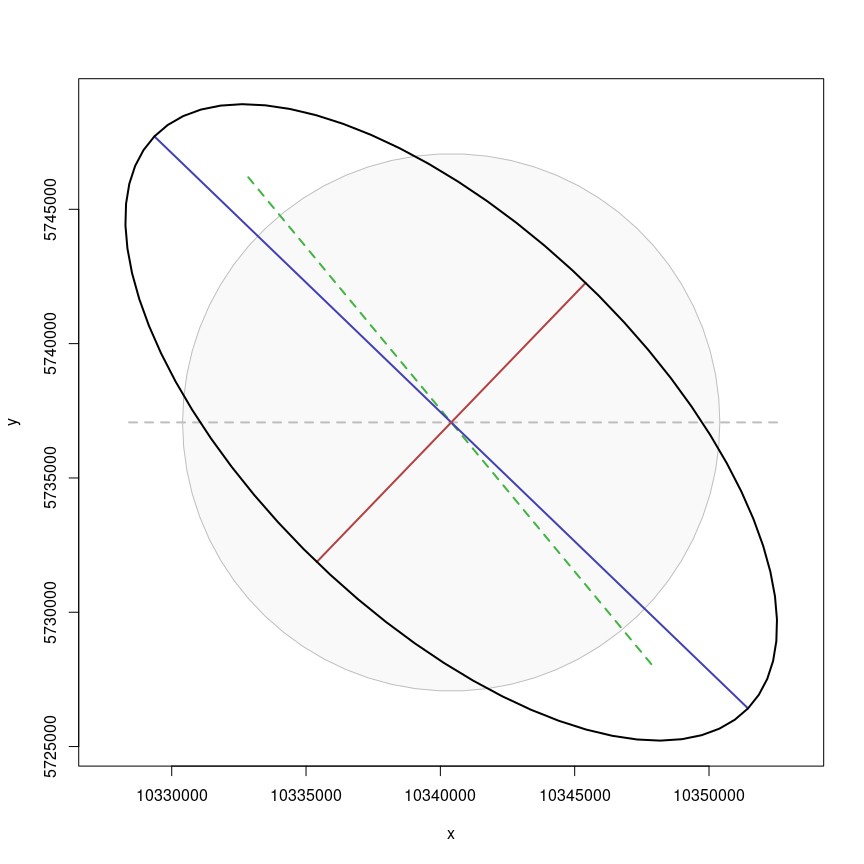
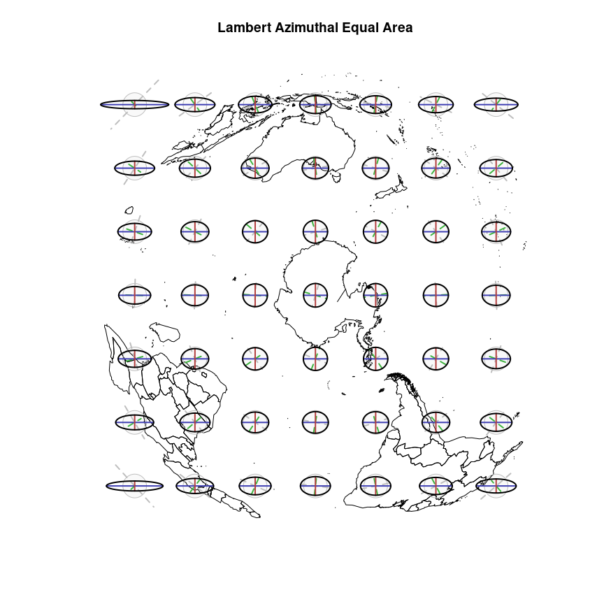
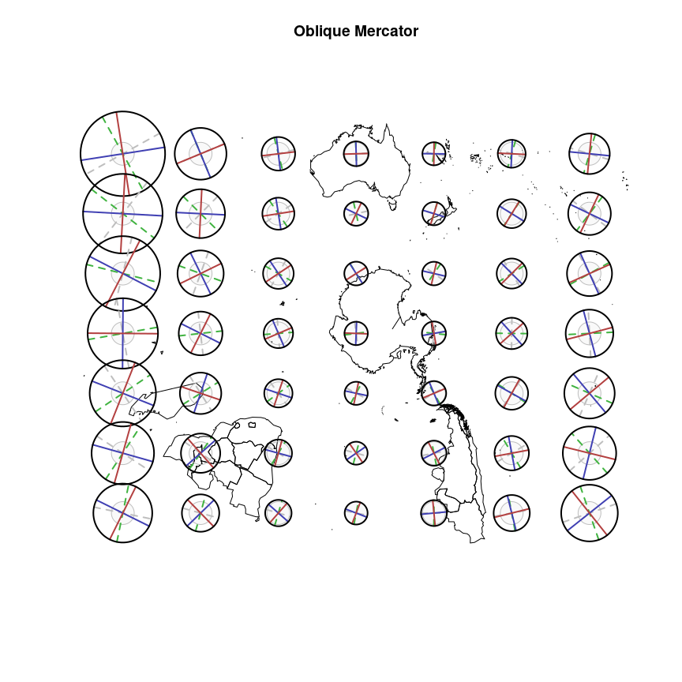
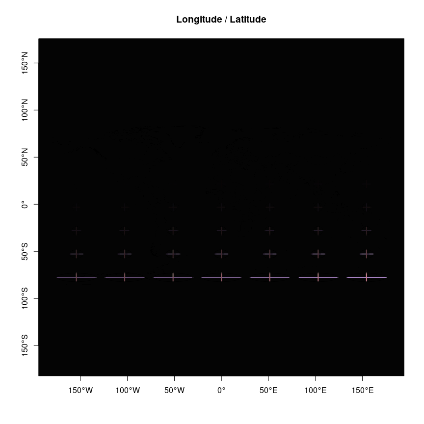

<!-- README.md is generated from README.Rmd. Please edit that file -->

    ## Warning in rgeos::gBuffer(wrld_simpl, width = 0, byid = T): Spatial object is
    ## not projected; GEOS expects planar coordinates

# The Tissot Indicatrix

The Tissot Indicatrix is used to characterize local distortions within
map projections.

<https://en.wikipedia.org/wiki/Tissot%27s_indicatrix>

NOTE: I am not the primary author of this great code only the package
creator, please see the DESCRIPTION for details. This package is in
early development and will change a lot, this is just a quick prototype
and needs quite a bit more to be useful.

## TODO

-   sort out the interface for inputting data, projections
-   semi-automate the scaling for the plot
-   provide control and better defaults for colours
-   check terminology (and spelling) is consistent

# Installation

Can be installed with

``` r
remotes::install_github("hypertidy/tissot")
```

# Minimal example

``` r
library(tissot)
# NAD 27 in
# World Robinson projection out
r <- tissot(130, 54,
           proj.in= "EPSG:4267",  ## "NAD27" doesn't work
           proj.out= "ESRI:54030")
i <- indicatrix(r, scale=10^4, n=71)
plot(i)
```



Derived from

<http://gis.stackexchange.com/questions/31651/an-example-tissot-ellipse-for-an-equirectangular-projection>

Also see

<https://gis.stackexchange.com/questions/5068/how-to-create-an-accurate-tissot-indicatrix>

# Polar example

``` r
library(tissot)
library(maptools)
#> Loading required package: sp
#> Checking rgeos availability: TRUE
library(raster)
buildandplot <- function(data, scale = 5e5, ...) {
  ## grid of points
  gr <- rasterToPoints(raster(data, nrow = 7, ncol = 7), spatial = FALSE)
  ## relying on dev {PROJ} that links to unreleased {libproj}
  grll <- do.call(cbind, PROJ::proj_trans(gr, "OGC:CRS84", source = projection(data) ))
  sp::plot(data,  ...)
  grll <- grll[!is.na(grll[,1]), ]
  for (i in seq_len(nrow(grll))) {
    tis <- tissot(grll[i, 1], grll[i, 2],  
                                               proj.in = projection(wrld_simpl), proj.out = projection(data))
   ind <- indicatrix(tis, scale = scale, n = 71)
   plot(ind, add = TRUE)
  }
  invisible(NULL)
}


## choose a projection
ptarget1 <- "+proj=stere +lon_0=147 +lat_ts-71 +lat_0=-90 +ellps=WGS84"
w1 <- spTransform(subset(wrld_simpl, coordinates(wrld_simpl)[,2] < 10), CRS(ptarget1))

ptarget2 <- "+proj=laea +lon_0=147 +lat_0=-90 +ellps=WGS84"
w2 <- spTransform(subset(wrld_simpl, coordinates(wrld_simpl)[,2] < 10), CRS(ptarget2))

ptarget3 <- "+proj=omerc +lonc=147 +gamma=9 +alpha=9 +lat_0=-80 +ellps=WGS84"
w3 <- spTransform(subset(wrld_simpl, coordinates(wrld_simpl)[,2] < -12), CRS(ptarget3), scale = 3e5)


buildandplot(w1, main = "Polar Stereographic")
```


``` r
buildandplot(w2, main = "Lambert Azimuthal Equal Area")
```



``` r
buildandplot(w3, main = "Oblique Mercator")
```



# Non-polar

``` r

## doesn't look right
# ptarget8 <- "+proj=laea +lat_0=-90"
# w8 <- spTransform(wrld_simpl, CRS(ptarget8))
# buildandplot(w8)


library(raster)
ptarget4 <- "+proj=merc +ellps=WGS84"
w4 <- spTransform(raster::intersect(disaggregate(wrld_simpl), as(extent(-180, 180, -85, 90), "SpatialPolygons")), ptarget4)
buildandplot(w4, main = "Mercator")
```


``` r
ptarget5 <- "+proj=lcc +ellps=WGS84 +lon_0=134 +lat_0=-30 +lat_1=-50 +lat_2=-20"
w5 <- spTransform(raster::intersect(disaggregate(wrld_simpl), as(extent(80, 180, -65, -10), "SpatialPolygons")), ptarget5)
buildandplot(w5, main = "Lambert Conformal Conic", scale = 3.5e5)
```


``` r

ptarget6 <- "+proj=utm +zone=50 +south +ellps=GRS80 +towgs84=0,0,0,0,0,0,0 +units=m +no_defs "

w6 <- spTransform(raster::intersect(disaggregate(wrld_simpl), as(extent(80, 160, -65, -10), "SpatialPolygons")), ptarget6)
buildandplot(w6, main = "UTM South Zone 50 ", col = "grey", scale = 2.5e5)
```


``` r


buildandplot(wrld_simpl, main = "Longitude / Latitude")
degAxis(1)
degAxis(2)
```



## SOM

``` r
## changes in spatial break this old hack
library(dplyr)
ex <- extent(c(20891678,  40158321, -13438415,  10618277))
target7 <- "+proj=lsat +lsat=5 +path=188"
library(spbabel)
tab <- sptable(spTransform(disaggregate(wrld_simpl), target7)) %>% filter(x_ >= xmin(ex), x_ <= xmax(ex), y_ >= ymin(ex), y_ <= ymax(ex))
## egregiously naive crop here, but good enough for the task
w7 <- sp(tab  %>% group_by(branch_)  %>% summarize(n = n())  %>% filter(n > 2) %>% inner_join(tab), crs = target7)
library(graticule)
g <- graticule(seq(-180, 165, by = 15), seq(-85, -20, by = 5), proj = target7, xlim = c(-180, 180), ylim = c(-85, -5))
buildandplot(w7, main = "Space Oblique Mercator, lsat=5, path=188 ", col = "grey", scale = 5e5)
plot(g, add = TRUE, lty = 2)
```

## Code of Conduct

Please note that the tissot project is released with a [Contributor Code
of
Conduct](https://contributor-covenant.org/version/2/0/CODE_OF_CONDUCT.html).
By contributing to this project, you agree to abide by its terms.
