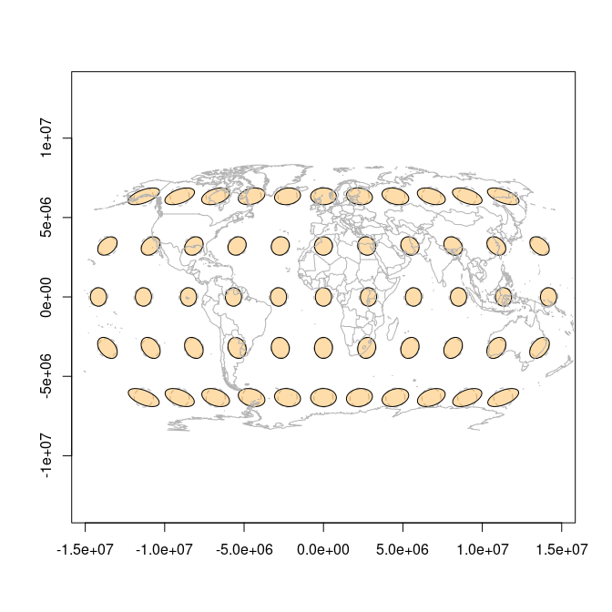
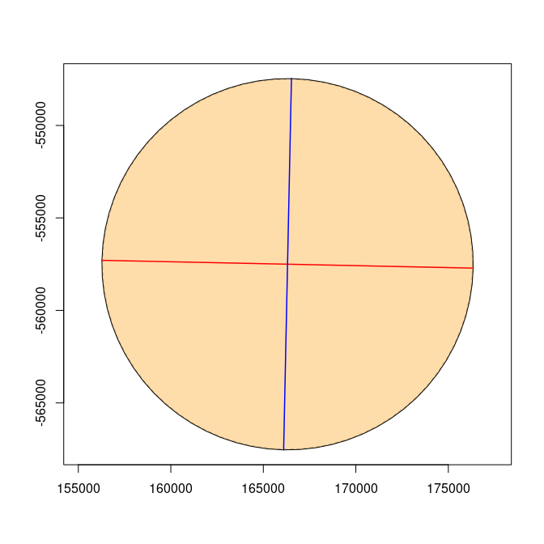
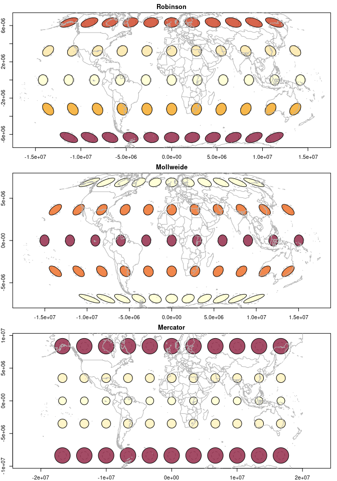
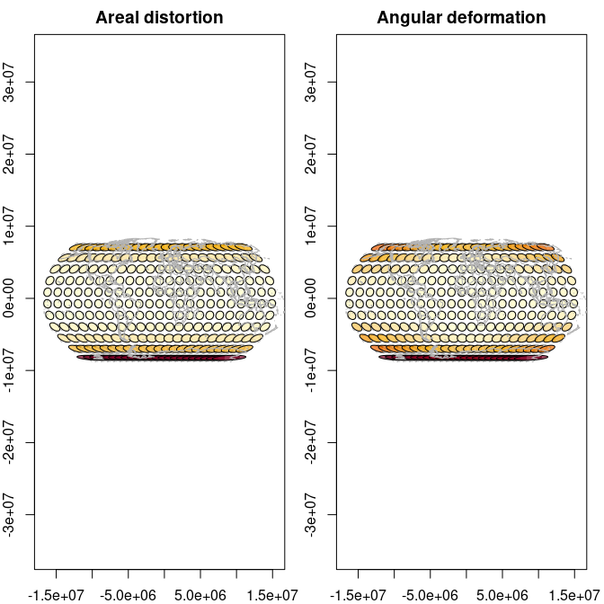
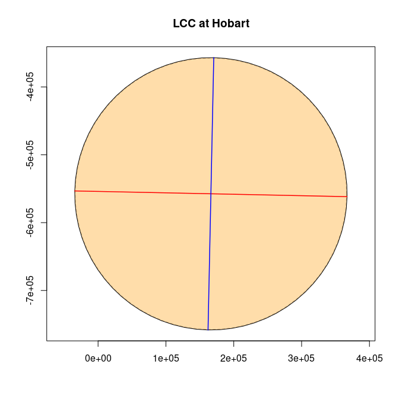
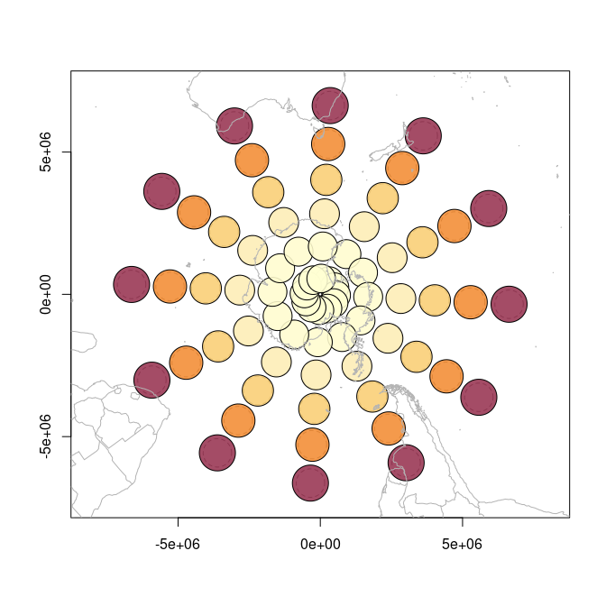

<!-- README.md is generated from README.Rmd. Please edit that file -->

<!-- badges: start -->

[](https://github.com/hypertidy/tissot/actions)
<!-- badges: end -->

# tissot

Compute and visualize the [Tissot
indicatrix](https://en.wikipedia.org/wiki/Tissot%27s_indicatrix) for map
projections. The indicatrix characterizes local distortion — how a unit
circle on the globe is warped into an ellipse by the projection —
revealing the trade-offs every map projection makes between preserving
shape, area, and direction.

Based on the calculations shared by [Bill Huber on GIS Stack
Exchange](https://gis.stackexchange.com/a/5075/482). Uses
[gdalraster](https://CRAN.R-project.org/package=gdalraster) for
coordinate transformation, so any projection that GDAL/PROJ can handle
works out of the box.

## Installation

``` r
# install.packages("remotes")
remotes::install_github("hypertidy/tissot")
```

## Quick start

``` r
library(tissot)

## Compute distortion properties at a grid of points
xy <- expand.grid(lon = seq(-150, 150, by = 30),
                  lat = seq(-60, 60, by = 30))

r <- tissot(xy, proj.out = "+proj=robin")
r
#> Tissot indicatrix: 55 points, +proj=robin
#> # A tibble: 55 × 14
#>        x     y dx_dlam dy_dlam dx_dphi dy_dphi scale.h scale.k scale.omega
#>    <dbl> <dbl>   <dbl>   <dbl>   <dbl>   <dbl>   <dbl>   <dbl>       <dbl>
#>  1  -150   -60    1.35       0  -0.895   0.946   1.30     1.35        47.0
#>  2  -120   -60    1.35       0  -0.716   0.946   1.19     1.35        40.0
#>  3   -90   -60    1.35       0  -0.537   0.946   1.09     1.35        33.2
#>  4   -60   -60    1.35       0  -0.358   0.946   1.01     1.35        26.9
#>  5   -30   -60    1.35       0  -0.179   0.946   0.963    1.35        22.2
#>  6     0   -60    1.35       0   0       0.946   0.946    1.35        20.4
#>  7    30   -60    1.35       0   0.179   0.946   0.963    1.35        22.2
#>  8    60   -60    1.35       0   0.358   0.946   1.01     1.35        26.9
#>  9    90   -60    1.35       0   0.537   0.946   1.09     1.35        33.2
#> 10   120   -60    1.35       0   0.716   0.946   1.19     1.35        40.0
#> # ℹ 45 more rows
#> # ℹ 5 more variables: scale.a <dbl>, scale.b <dbl>, scale.area <dbl>,
#> #   angle_deformation <dbl>, convergence <dbl>
```

The result is a tibble with one row per input point. Key columns:

| Column | Meaning |
|----|----|
| `scale.h` | Meridional (north–south) scale factor |
| `scale.k` | Parallel (east–west) scale factor |
| `scale.a`, `scale.b` | Semi-major and semi-minor axes of the indicatrix ellipse |
| `scale.area` | Areal distortion (= 1 for equal-area projections) |
| `angle_deformation` | Maximum angular distortion in degrees (= 0 for conformal projections) |
| `convergence` | Angle of the projected meridian from grid north |

## Plotting indicatrices

Build indicatrix ellipses and plot them over a map:

``` r
ii <- indicatrix(r)
plot(ii, scale = 6e5, add = FALSE, show.circle = TRUE, show.axes = TRUE)
tissot_map()
#> Warning in .transform_xy(pts_in, srs_from, srs_to): 1972 point(s) had missing
#> values, NA returned in that case
```

<!-- -->

The `indicatrix()` function accepts the `tissot_tbl` directly — it
extracts the projection from its attributes. You can also call it with
raw coordinates:

``` r
ii_single <- indicatrix(130, -42, proj.out = "+proj=stere +lat_0=-90")
plot(ii_single, scale = 3e5, add = FALSE, show.axes = TRUE, show.circle = TRUE)
```

<!-- -->

## Comparing projections

``` r
xy <- expand.grid(lon = seq(-150, 150, by = 30),
                  lat = seq(-60, 60, by = 30))
projs <- c(Robinson = "+proj=robin",
           Mollweide = "+proj=moll",
           Mercator = "+proj=merc")

par(mfrow = c(3, 1), mar = c(2, 2, 2, 1))
for (nm in names(projs)) {
  r <- tissot(xy, proj.out = projs[nm])
  ii <- indicatrix(r)
  plot(ii, scale = 6e5, add = FALSE, fill.by = "scale.area")
  tissot_map()
  title(main = nm)
}
#> Warning in .transform_xy(pts_in, srs_from, srs_to): 1972 point(s) had missing
#> values, NA returned in that case
#> Warning in .transform_xy(pts_in, srs_from, srs_to): 1972 point(s) had missing
#> values, NA returned in that case
#> Warning in .transform_xy(pts_in, srs_from, srs_to): 1972 point(s) had missing
#> values, NA returned in that case
```

<!-- -->

Mollweide is equal-area (uniform colour), Mercator is conformal
(circles, but area grows toward the poles), and Robinson is a
compromise.

## Colour by distortion

Use `fill.by` to colour-code ellipses by any distortion metric:

``` r
r <- tissot(expand.grid(seq(-172, 172, by = 15),
                        seq(-82, 82, by = 15)),
            proj.out = "+proj=robin")
ii <- indicatrix(r)

par(mfrow = c(1, 2), mar = c(2, 2, 2, 1))
plot(ii, scale = 6e5, add = FALSE, fill.by = "scale.area")
tissot_map()
#> Warning in .transform_xy(pts_in, srs_from, srs_to): 1972 point(s) had missing
#> values, NA returned in that case
title("Areal distortion")

plot(ii, scale = 6e5, add = FALSE, fill.by = "angle_deformation")
tissot_map()
#> Warning in .transform_xy(pts_in, srs_from, srs_to): 1972 point(s) had missing
#> values, NA returned in that case
title("Angular deformation")
```

<!-- -->

## Rich single-indicatrix plots

Each indicatrix can display the reference unit circle (dashed white),
lambda direction (red = parallel scale), and phi direction (blue =
meridional scale):

``` r
r <- tissot(147, -42, proj.out = "+proj=lcc +lat_1=-36 +lat_2=-38 +lat_0=-37 +lon_0=145")
ii <- indicatrix(r)
plot(ii[[1]], scale = 2e5, add = FALSE, show.axes = TRUE, show.circle = TRUE)
title("LCC at Hobart")
```

<!-- -->

## Polar projections

``` r
polar_pts <- expand.grid(lon = seq(-165, 165, by = 30),
                         lat = seq(-85, -30, by = 10))
p <- tissot(polar_pts, proj.out = "+proj=stere +lat_0=-90 +lon_0=147")
ii <- indicatrix(p)
plot(ii, scale = 5e5, add = FALSE)
tissot_map()
#> Warning in .transform_xy(pts_in, srs_from, srs_to): 1972 point(s) had missing
#> values, NA returned in that case
title("Polar Stereographic")
```

<!-- -->

## Distortion summary

``` r
r <- tissot(expand.grid(seq(-150, 150, by = 30), seq(-60, 60, by = 30)),
            proj.out = "+proj=robin")
summary(r)
#> Tissot indicatrix: 55 points
#>   Source CRS: EPSG:4326
#>   Target CRS: +proj=robin
#>   Areal scale:  min=0.8209  max=1.2790  mean=1.0468
#>   Angular def:  min=1.5058  max=52.3188  mean=21.3786 deg
#>   Scale h:      min=0.8790  max=1.3023  (meridional)
#>   Scale k:      min=0.8487  max=1.3521  (parallel)
```

## Code of Conduct

Please note that the tissot project is released with a [Contributor Code
of
Conduct](https://contributor-covenant.org/version/2/0/CODE_OF_CONDUCT.html).
By contributing to this project, you agree to abide by its terms.
