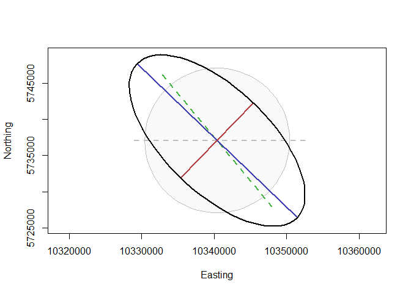
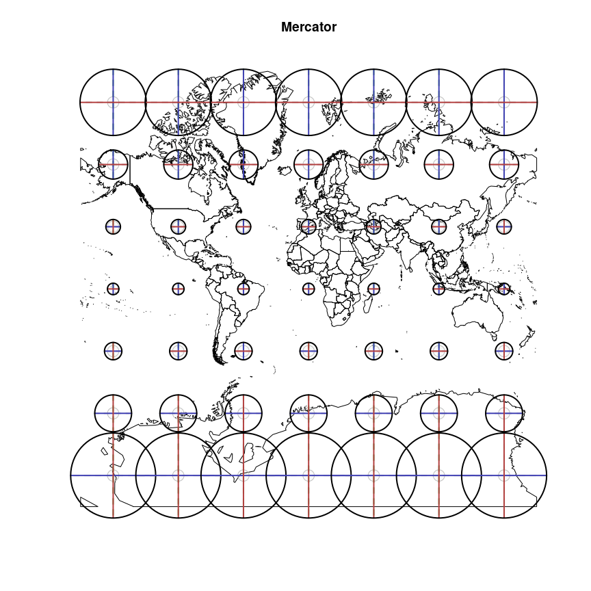
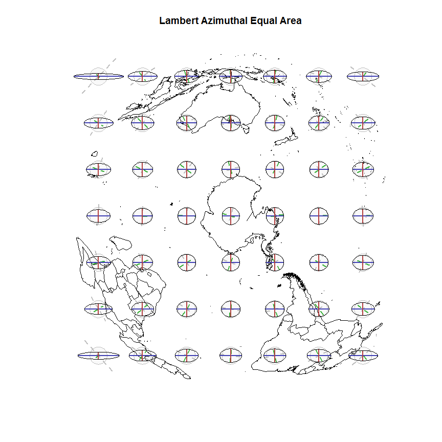
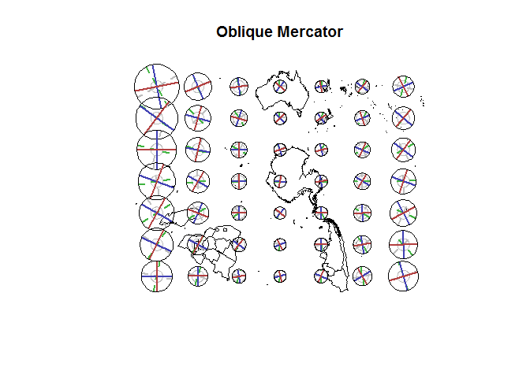
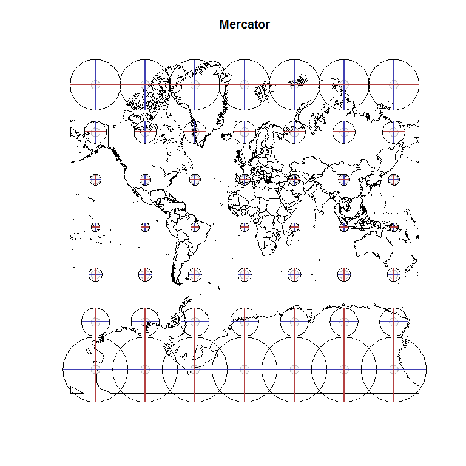
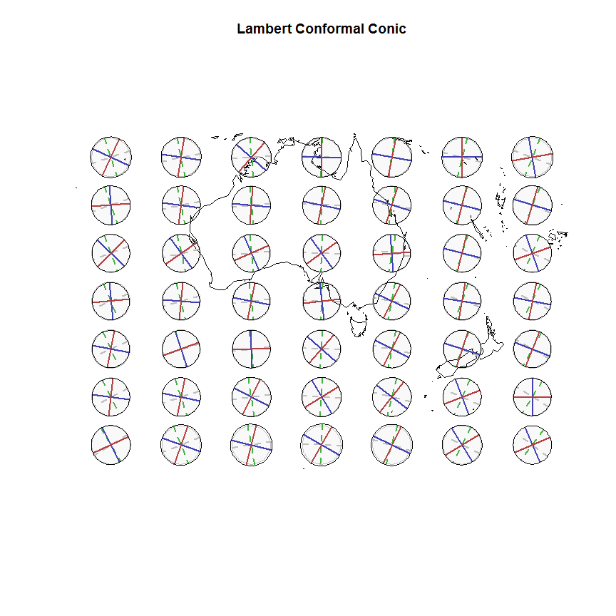
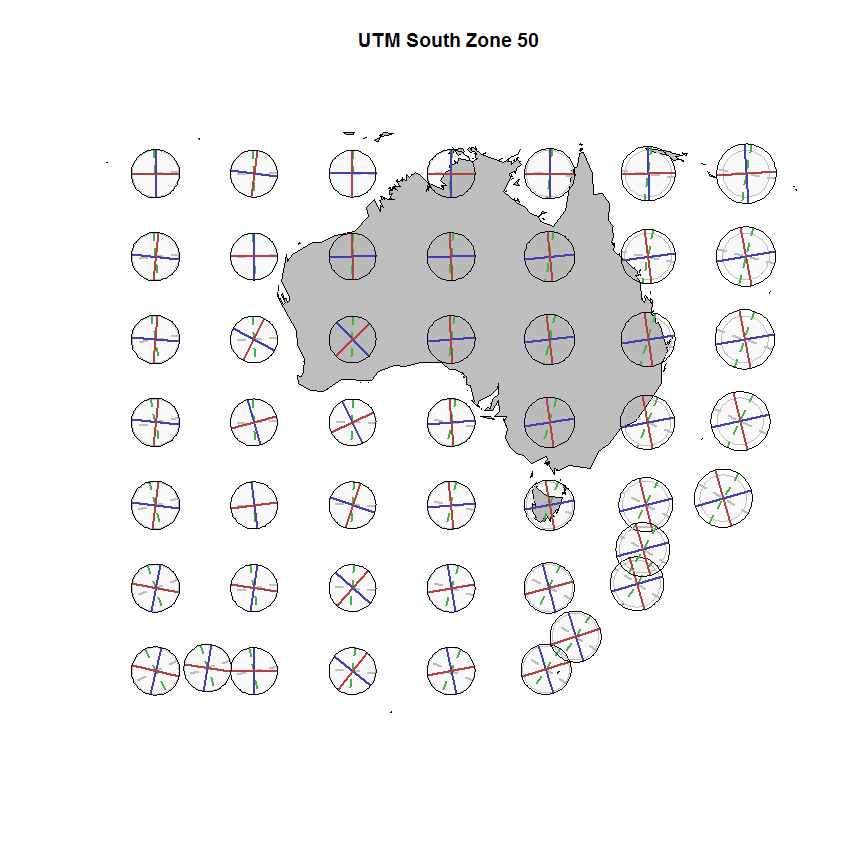
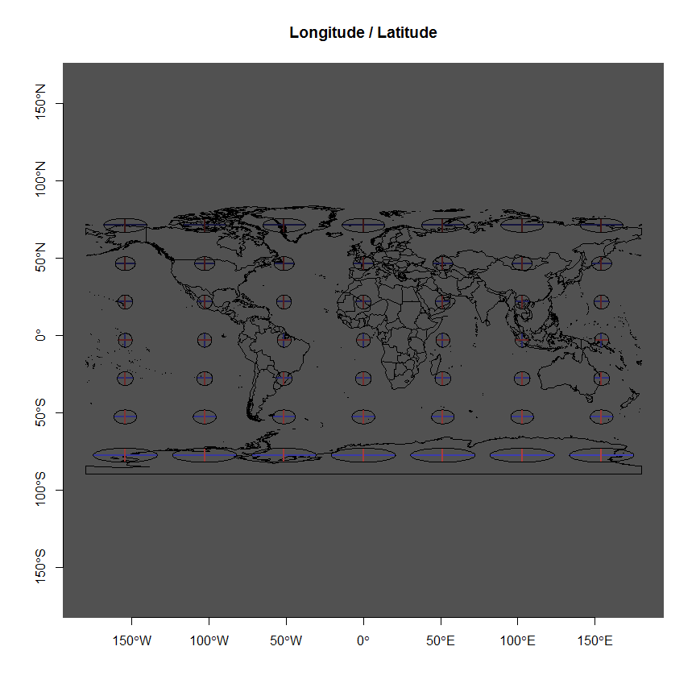
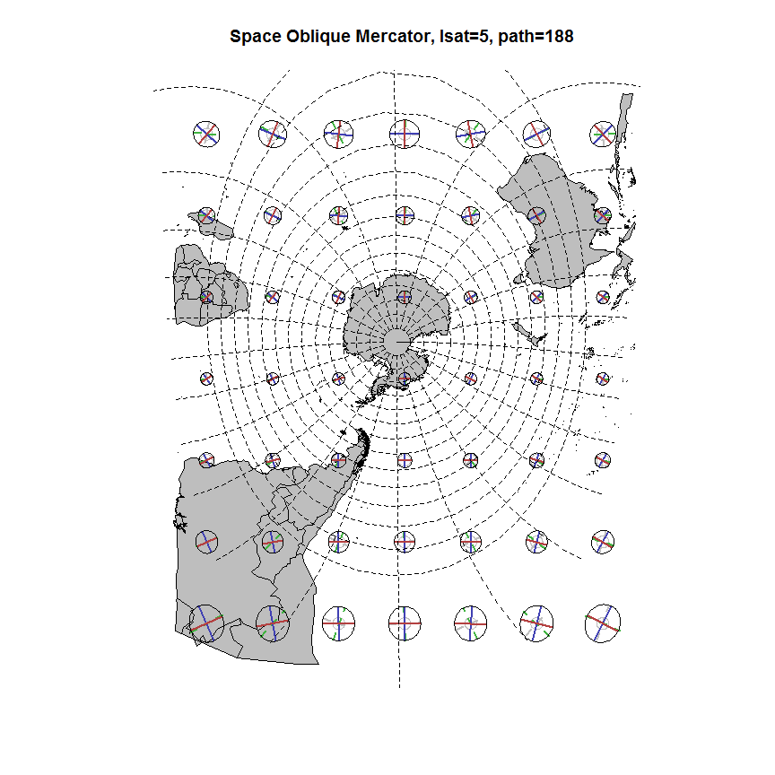

[](https://travis-ci.org/mdsumner/tissot)

<!-- README.md is generated from README.Rmd. Please edit that file -->
The Tissot Indicatrix
=====================

The Tissot Indicatrix is used to characterize local distortions within map projections.

<https://en.wikipedia.org/wiki/Tissot%27s_indicatrix>

NOTE: I am not the primary author of this great code only the package creator, please see the DESCRIPTION for details.  This package is in early development and will change a lot, this is just a quick prototype and needs quite a bit more to be useful.

TODO
----

-   sort out the interface for inputting data, projections
-   semi-automate the scaling for the plot
-   provide control and better defaults for colours
-   check terminology (and spelling) is consistent

Installation
============

Can be installed with

``` r
devtools::install_github("mdsumner/tissot")
```

Minimal example
===============

``` r
library(tissot)
 library(rgdal)
 prj <- function(z, proj.in, proj.out) {
   z.pt <- SpatialPoints(coords=matrix(z, ncol=2), proj4string=proj.in)
   w.pt <- spTransform(z.pt, CRS=proj.out)
   w.pt@coords[1, ]
 }
 # Longitude, latitude, and reprojection function
 # NAD 27 in
 # World Robinson projection out
 r <- tissot(130, 54, prj,
             proj.in=CRS("+init=epsg:4267"),
             proj.out=CRS("+init=esri:54030"))

 i <- indicatrix(r, scale=10^4, n=71)
 plot(i$outline, type="n", asp=1, xlab="Easting", ylab="Northing")
 polygon(i$base, col=rgb(0, 0, 0, .025), border="Gray")
 lines(i$d.lambda, lwd=2, col="Gray", lty=2)
 lines(i$d.phi, lwd=2, col=rgb(.25, .7, .25), lty=2)
 lines(i$axis.major, lwd=2, col=rgb(.25, .25, .7))
 lines(i$axis.minor, lwd=2, col=rgb(.7, .25, .25))
 lines(i$outline, asp=1, lwd=2)
```



Derived from

<http://gis.stackexchange.com/questions/31651/an-example-tissot-ellipse-for-an-equirectangular-projection>


Also see

https://gis.stackexchange.com/questions/5068/how-to-create-an-accurate-tissot-indicatrix


Polar example
=============

``` r
library(tissot)
library(rgdal)
library(maptools)
#> Checking rgeos availability: TRUE
data(wrld_simpl)
prj <- function(z, proj.in, proj.out) {
  z.pt <- SpatialPoints(coords=matrix(z, ncol=2), proj4string=proj.in)
  w.pt <- spTransform(z.pt, CRS=proj.out)
  w.pt@coords[1, ]
}
library(raster)

buildandplot <- function(data, scale = 5e5, ...) {
  ## grid of points
  gr <- rasterToPoints(raster(data, nrow = 7, ncol = 7), spatial = TRUE)
  grll <- spTransform(gr, CRS(projection(wrld_simpl)))
  tis <- vector("list", length(gr))
  for (i in seq_along(tis)) tis[[i]] <- tissot(coordinates(grll)[i, 1], coordinates(grll)[i, 2], prj,  
                                               proj.in = CRS(projection(wrld_simpl)), proj.out = projection(data))
plot(data,  ...)
for (j in seq_along(tis)) {
  i <- indicatrix(tis[[j]], scale = scale, n = 71)
  polygon(i$base, col=rgb(0, 0, 0, .025), border="Gray")
  lines(i$d.lambda, lwd=2, col="Gray", lty=2)
  lines(i$d.phi, lwd=2, col=rgb(.25, .7, .25), lty=2)
  lines(i$axis.major, lwd=2, col=rgb(.25, .25, .7))
  lines(i$axis.minor, lwd=2, col=rgb(.7, .25, .25))
  lines(i$outline, asp=1, lwd=1)
  
}
invisible(NULL)
}
## choose a projection
ptarget1 <- "+proj=stere +lon_0=147 +lat_ts-71 +lat_0=-90 +ellps=WGS84"
w1 <- spTransform(subset(wrld_simpl, coordinates(wrld_simpl)[,2] < 10), CRS(ptarget1))

ptarget2 <- "+proj=laea +lon_0=147 +lat_0=-90 +ellps=WGS84"
w2 <- spTransform(subset(wrld_simpl, coordinates(wrld_simpl)[,2] < 10), CRS(ptarget2))

ptarget3 <- "+proj=omerc +lonc=147 +gamma=9 +alpha=9 +lat_0=-80 +ellps=WGS84"
w3 <- spTransform(subset(wrld_simpl, coordinates(wrld_simpl)[,2] < -12), CRS(ptarget3), scale = 3e5)


buildandplot(w1, main = "Polar Stereographic")
```



``` r
buildandplot(w2, main = "Lambert Azimuthal Equal Area")
```



``` r
buildandplot(w3, main = "Oblique Mercator")
```



Non-polar
=========

``` r
library(raster)
ptarget4 <- "+proj=merc +ellps=WGS84"
w4 <- spTransform(raster::intersect(disaggregate(wrld_simpl), as(extent(-180, 180, -85, 90), "SpatialPolygons")), ptarget4)
buildandplot(w4, main = "Mercator")
```



``` r

ptarget5 <- "+proj=lcc +ellps=WGS84 +lon_0=134 +lat_0=-30 +lat_1=-50 +lat_2=-20"
w5 <- spTransform(raster::intersect(disaggregate(wrld_simpl), as(extent(80, 180, -65, -10), "SpatialPolygons")), ptarget5)
buildandplot(w5, main = "Lambert Conformal Conic", scale = 3.5e5)
```



``` r


ptarget6 <- "+proj=utm +zone=50 +south +ellps=GRS80 +towgs84=0,0,0,0,0,0,0 +units=m +no_defs "

w6 <- spTransform(raster::intersect(disaggregate(wrld_simpl), as(extent(80, 160, -65, -10), "SpatialPolygons")), ptarget6)
buildandplot(w6, main = "UTM South Zone 50 ", col = "grey", scale = 2.5e5)
```



``` r


buildandplot(wrld_simpl, main = "Longitude / Latitude")
degAxis(1)
degAxis(2)
```



SOM
---

``` r
ex <- extent(c(20891678,  40158321, -13438415,  10618277))
target7 <- "+proj=lsat +lsat=5 +path=188"
library(spbabel)
#> Loading required package: dplyr
#> 
#> Attaching package: 'dplyr'
#> The following objects are masked from 'package:raster':
#> 
#>     intersect, select, union
#> The following objects are masked from 'package:stats':
#> 
#>     filter, lag
#> The following objects are masked from 'package:base':
#> 
#>     intersect, setdiff, setequal, union
tab <- sptable(spTransform(disaggregate(wrld_simpl), target7)) %>% filter(x_ >= xmin(ex), x_ <= xmax(ex), y_ >= ymin(ex), y_ <= ymax(ex))
## egregiously naive crop here, but good enough for the task
w7 <- sp(tab  %>% group_by(branch_)  %>% summarize(n = n())  %>% filter(n > 2) %>% inner_join(tab), crs = target7)
#> Joining by: "branch_"
library(graticule)
g <- graticule(seq(-180, 165, by = 15), seq(-85, -20, by = 5), proj = target7, xlim = c(-180, 180), ylim = c(-85, -5))
buildandplot(w7, main = "Space Oblique Mercator, lsat=5, path=188 ", col = "grey", scale = 5e5)
plot(g, add = TRUE, lty = 2)
```


