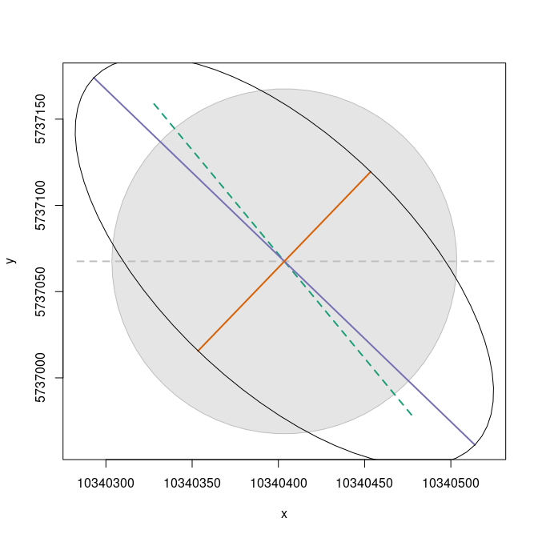
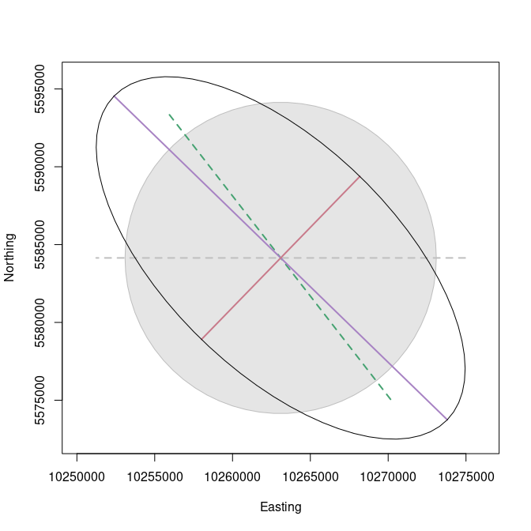
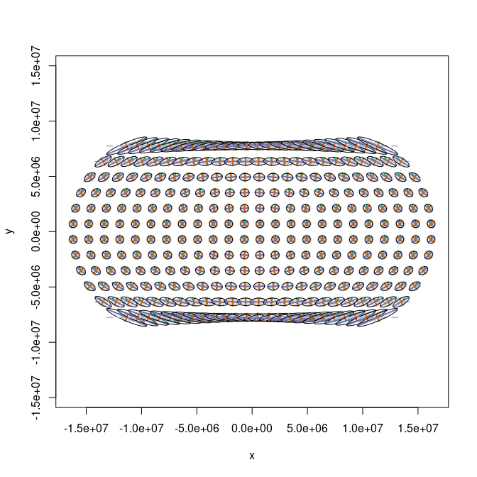
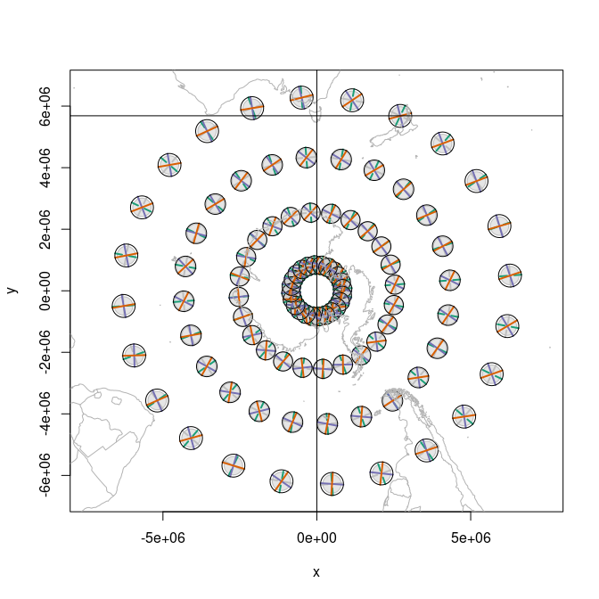
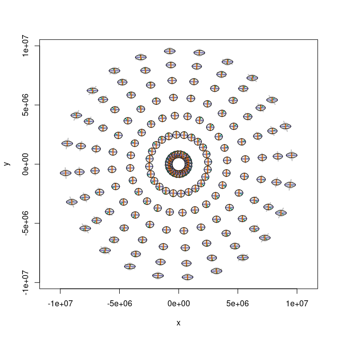
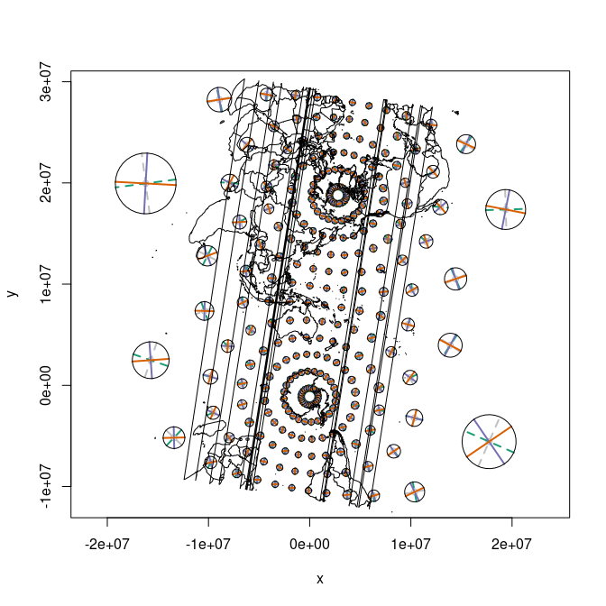
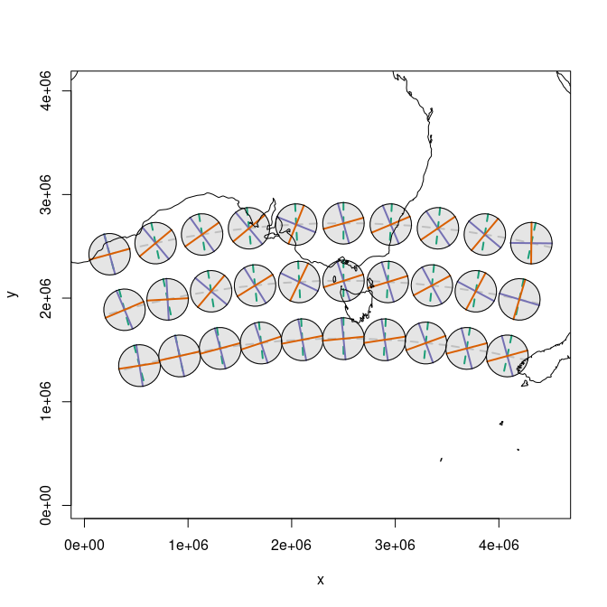

<!-- README.md is generated from README.Rmd. Please edit that file -->

<!-- badges: start -->
[](https://github.com/hypertidy/tissot/actions)
<!-- badges: end -->

# The Tissot Indicatrix

The [Tissot
Indicatrix](https://en.wikipedia.org/wiki/Tissot%27s_indicatrix) is used
to characterize local distortions within map projections.

I have derived the code in this package (with permission) from Bill
Huber’s wonderful online answer here:

<http://gis.stackexchange.com/questions/31651/an-example-tissot-ellipse-for-an-equirectangular-projection>

Also see

<https://gis.stackexchange.com/questions/5068/how-to-create-an-accurate-tissot-indicatrix>

# Installation

Can be installed with

``` r
remotes::install_github("hypertidy/tissot")
```

# Minimal example

``` r
library(tissot)
# NAD 27 in
# World Robinson projection out
r <- tissot(130, 54,
           proj.in= "EPSG:4267",  
           proj.out= "ESRI:54030")
i0 <- indicatrix(r, scale=1e2, n=71)
plot(i0)
```



``` r
plot(tissot:::.prj(earthcircle::earthcircle(130, 54, scale = 5e2), tissot_get_proj()))
#> assuming WGS84 for unprojected angular coordinates
tissot_abline(130, 54)
#> assuming WGS84 for unprojected angular coordinates
```


``` r
tissot_map(add = FALSE, xlim = c(8.5e6, 1.3e7), ylim = c(4e6, 7e6))
i1 <- indicatrix(r, scale=1e6, n=71)
plot(i1, add = T)
tissot_abline(130, 54)
#> assuming WGS84 for unprojected angular coordinates
lines(tissot:::.prj(earthcircle::earthcircle(130, 54, scale = 2e6), tissot_get_proj()) %*% (diag(2) * 2))
#> assuming WGS84 for unprojected angular coordinates
```


Since an original port of whuber’s code we have now made it much easier
to create many indicatrixes and plot them in one step. Or we can still
just grab one and plot it on its own. Note that the scale is quite
different in these plots.

``` r
x <- seq(-172.5, 172.5, by = 15)
y <- seq(-82.5, 82.5, by = 15)
xy <- expand.grid(x, y)
r <- tissot(xy,
            proj.in= "OGC:CRS84",
            proj.out= "+proj=robin")

j <- which.min(abs(135 - r$lon) + abs(54 - r$lat))
i <- indicatrix0(r[j, ], scale= 1e4, n=71)
plot(i, add = FALSE)
```



``` r
ii <- indicatrix(r, scale=4e5, n=71)
tissot_map(add = FALSE)
plot(ii, add = TRUE)
tissot_abline(xy[j, 1], xy[j, 2])
#> assuming WGS84 for unprojected angular coordinates
```


Mollweide.

``` r
m <- tissot(xy,
            proj.in= "OGC:CRS84",
            proj.out= "+proj=moll")


plot(indicatrix(m, scale=4e5, n=71), add = FALSE)
tissot_map()
```


Eckhert III

``` r
e <- tissot(xy,
            proj.in= "OGC:CRS84",
            proj.out= "+proj=eck3")


plot(indicatrix(e, scale=4e5, n=71), add = FALSE)
```



Equidistant

``` r
aeqd <- tissot(xy,
            proj.in= "OGC:CRS84",
            proj.out= "+proj=aeqd")


plot(indicatrix(aeqd, scale=4e5, n=71), add = FALSE)
```


Cassini-Soldner (spherical because ellipsoidal seems broken)

``` r
xx <- tissot(xy,
            proj.in= "OGC:CRS84",
            proj.out= "+proj=cass +R=6378137")


plot(indicatrix(xx, scale=4e5, n=71), add = FALSE)
points(tissot_map(col = "transparent"), pch = ".")
```


Sinusoidal

``` r
s <- tissot(xy,
            proj.in= "OGC:CRS84",
            proj.out= "+proj=sinu")


plot(indicatrix(s, scale=3e5, n=71), add = FALSE)
tissot_map()
```


# Polar example

``` r
p <- tissot(xy[xy[,2] < -30, ],
            proj.in= "OGC:CRS84",
            proj.out= "+proj=stere +lon_0=147 +lat_ts-71 +lat_0=-90 +datum=WGS84")

plot(indicatrix(p, scale = 3e5))
tissot_map()
tissot_abline(147, -42)
#> assuming WGS84 for unprojected angular coordinates
```



``` r
laea <- tissot(xy[xy[,2] < 20, ],
            proj.in= "OGC:CRS84",
            proj.out= "+proj=laea +lon_0=147 +lat_0=-90 +datum=WGS84")

plot(indicatrix(laea, scale = 3e5))
```



Oblique Mercator

You get the idea … many projections need extra attention for real data.

``` r
mp0 <- do.call(cbind, maps::map(plot = FALSE)[1:2])
omerc <- "+proj=omerc +lonc=147 +gamma=9 +alpha=9 +lat_0=-80 +ellps=WGS84"
mp <- tissot:::.prj(mp0, omerc, proj.in = "OGC:CRS84")
o <- tissot(xy,
            proj.in= "OGC:CRS84",
            proj.out= omerc)

plot(indicatrix(o, scale = 3e5))
lines(mp)
```



VicGrid

``` r
vgrid <- "+proj=lcc +lat_1=-36 +lat_2=-38 +lat_0=-37 +lon_0=145 +x_0=2500000 +y_0=2500000 +ellps=GRS80 +towgs84=0,0,0,0,0,0,0 +units=m +no_defs"
mp <- tissot:::.prj(mp0, vgrid, proj.in = "OGC:CRS84")
v <- tissot(as.matrix(expand.grid(seq(120, 165, by =5 ), 
                                          seq(-45, -35, by = 5))),
            proj.in= "OGC:CRS84",
            proj.out= vgrid)

plot(indicatrix(v, scale = 2e5))
lines(mp)
```



UTM Zone 54 (Hobart)

``` r
utm <- "+proj=utm +zone=54 +south"
mp <- tissot:::.prj(mp0, utm, proj.in = "OGC:CRS84")
u <- tissot(as.matrix(expand.grid(seq(108, 162, by =6 ), 
                                          seq(-65, 55, by = 15))),
            proj.in= "OGC:CRS84",
            proj.out= utm)

plot(indicatrix(u, scale = 2e5))
lines(mp)
```


## Code of Conduct

Please note that the tissot project is released with a [Contributor Code
of
Conduct](https://contributor-covenant.org/version/2/0/CODE_OF_CONDUCT.html).
By contributing to this project, you agree to abide by its terms.
