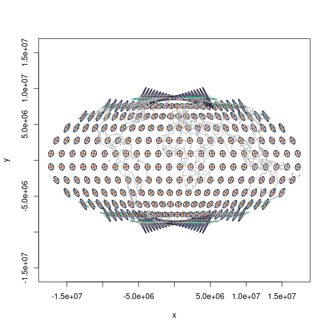

<!-- README.md is generated from README.Rmd. Please edit that file -->

<!-- badges: start -->

[](https://github.com/hypertidy/tissot/actions/workflows/R-CMD-check.yaml)
<!-- badges: end -->

# tissot

The [Tissot
Indicatrix](https://en.wikipedia.org/wiki/Tissot%27s_indicatrix)
characterizes local distortion in map projections. This package computes
and plots indicatrixes using a vectorized finite-difference Jacobian
with [gdalraster](https://firelab.github.io/gdalraster/) as the
projection engine.

Derived (with permission) from Bill Huber’s [GIS StackExchange
answer](https://gis.stackexchange.com/a/5075/482).

## Installation

``` r
# install.packages("pak")
pak::pak("hypertidy/tissot@refactor-2026")
```

## Quick start

`tissot()` returns a tibble of distortion properties. The second
argument is the projection `target`; `source` defaults to EPSG:4326:

``` r
library(tissot)
tissot(c(147, -42), "+proj=utm +zone=55 +south")
#> Tissot indicatrix: 1 point, +proj=utm +zone=55 +south
#> # A tibble: 1 × 14
#>       x     y dx_dlam      dy_dlam dx_dphi dy_dphi scale.h scale.k scale.omega
#>   <dbl> <dbl>   <dbl>        <dbl>   <dbl>   <dbl>   <dbl>   <dbl>       <dbl>
#> 1   147   -42   1.000 -0.000000584       0   1.000   1.000   1.000   0.0000335
#> # ℹ 5 more variables: scale.a <dbl>, scale.b <dbl>, scale.area <dbl>,
#> #   angle_deformation <dbl>, convergence <dbl>
```

Columns include: `scale.h` (meridional), `scale.k` (parallel), `scale.a`
/ `scale.b` (max/min singular values), `scale.area`,
`angle_deformation`, and `convergence`.

## Plotting indicatrixes

`indicatrix()` builds plottable ellipses. The dashed circle is the
undistorted reference; the filled ellipse shows the projection’s
distortion:

``` r
xy <- expand.grid(seq(-150, 150, by = 30), seq(-60, 60, by = 30))
r <- tissot(xy, "+proj=robin")
ii <- indicatrix(r)
plot(ii, scale = 6e5, add = FALSE, show.axes  = TRUE, show.circle = TRUE)
tissot_map()
#> Warning in .transform_xy(pts_in, srs_from, srs_to): 1972 point(s) had missing
#> values, NA returned in that case
```

<!-- -->

## Colour-coded distortion

Pass `fill.by` to colour ellipses by a distortion metric:

``` r
plot(ii, scale = 6e5, add = FALSE, fill.by = "scale.area")
tissot_map()
#> Warning in .transform_xy(pts_in, srs_from, srs_to): 1972 point(s) had missing
#> values, NA returned in that case
```

<!-- -->

## Projection comparison

``` r
m <- tissot(xy, "+proj=moll")
plot(indicatrix(m), scale = 5e5, add = FALSE)
tissot_map()
#> Warning in .transform_xy(pts_in, srs_from, srs_to): 1972 point(s) had missing
#> values, NA returned in that case
```

<!-- -->

``` r
merc_xy <- expand.grid(seq(-150, 150, by = 30), seq(-75, 75, by = 15))
me <- tissot(merc_xy, "+proj=merc")
plot(indicatrix(me), scale = 5e5, add = FALSE)
tissot_map()
#> Warning in .transform_xy(pts_in, srs_from, srs_to): 1972 point(s) had missing
#> values, NA returned in that case
```

<!-- -->

## Rich single-indicatrix plots

A single indicatrix with axes and reference circle:

``` r
ii2 <- indicatrix(c(147, -42), "+proj=lcc +lat_1=-36 +lat_2=-38 +lat_0=-37 +lon_0=145")
plot(ii2[[1]], scale = 1e4, add = FALSE, show.axes = TRUE, show.circle = TRUE)
```

<!-- -->

## Polar projections

``` r
polar_xy <- expand.grid(seq(-180, 150, by = 30), seq(-85, -30, by = 10))
p <- tissot(polar_xy, "+proj=stere +lat_0=-90 +lon_0=147")
plot(indicatrix(p), scale = 5e5, add = FALSE, fill.by = "scale.area")
tissot_map()
#> Warning in .transform_xy(pts_in, srs_from, srs_to): 1972 point(s) had missing
#> values, NA returned in that case
```

<!-- -->

``` r
la <- tissot(polar_xy, "+proj=laea +lat_0=-90 +lon_0=147")
plot(indicatrix(la), scale = 5e5, add = FALSE)
tissot_map()
#> Warning in .transform_xy(pts_in, srs_from, srs_to): 1972 point(s) had missing
#> values, NA returned in that case
```

<!-- -->

## Distortion summary

``` r
summary(r)
#> Tissot indicatrix: 55 points
#>   Source CRS: EPSG:4326
#>   Target CRS: +proj=robin
#>   Areal scale:  min=0.8209  max=1.2790  mean=1.0468
#>   Angular def:  min=1.5058  max=52.3188  mean=21.3786 deg
#>   Scale h:      min=0.8790  max=1.3023  (meridional)
#>   Scale k:      min=0.8487  max=1.3521  (parallel)
```

## Code of Conduct

Please note that the tissot project is released with a [Contributor Code
of
Conduct](https://contributor-covenant.org/version/2/0/CODE_OF_CONDUCT.html).
By contributing to this project, you agree to abide by its terms.
